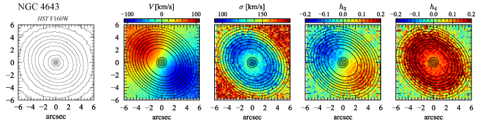

# Public data, code, and notebooks for Erwin et al. (2020) paper on NGC 4608 and NGC 4643

This git repository contains data files, Python code, and Python Jupyter
notebooks which can be used to reproduce figures and analyses from the
paper ["Composite Bulges -- II. Classical Bulges and Nuclear Disks in
Barred Galaxies: The Contrasting Cases of NGC 4608 and NGC
4643"](https://www.mpe.mpg.de/~erwin/temp/n4608_n4643_paper.pdf) (Erwin et
al. 2021, *Monthly Notices of the Royal Astronomical Society*,
in press).

**NOTE: THIS IS CURRENTLY AN INCOMPLPETE WORK IN PROGRESS!**

(This figure shows the near-IR morphology and stellar kinematics of the
nuclear-disk region inside the bar of the SB0/a galaxy NGC 4643.
Leftmost panel: *HST* WFC3-IR F160W isophotes. Other panels: VLT-MUSE
stellar kinematics for the same region, overlaid with isophotes from the
ratio image of our best-fitting model (solid contours = nuclear-disk
component is dominant). (See Section 5.2 and Figure 18 of the paper for
more details.))

## Dependencies

The Python code and notebooks require the following external Python modules and packages,
all of which are available on PyPI and can be installed via `pip`:

   * [Numpy](https://www.numpy.org), [Scipy](https://www.scipy.org), 
   [matplotlib](https://matplotlib.org), [Scikit-Image](https://scikit-image.org)

## Jupyter Notebooks

   * `n4608n4643_figures_for_paper.ipynb` -- generates the figures for the paper (including
   individual plots for multi-plot figures)

<!-- 
There are two Jupyter Python notebooks:

   * `barsize_fits.ipynb` -- generates (and saves to a text file) various fits

   * `barsizes_figures_for_paper.ipynb` -- generates the figures for the paper (using
   fit coefficients saved by the first notebook)
 -->

## Python Code

   * `plotutils.py` -- assorted functions used in generating figures

<!-- 
   * `datasets.py`, `datautils.py`, `plotutils.py`, `s4gutils.py` -- miscellaneous utility functions
   (including statistics).
   
   * `sample_defs.py` -- definitions of various subsamples of S4G galaxies, in the
   form of integer lists of index values (slices, more or less).
   
   * `fitting_barsizes.py` -- code to assist with the fits in the Jupyter notebook
   `barsize_fits.ipynb`.

   * `make_fit_tables.py` -- code to generate LaTeX tables for the paper
 -->

## Data Files

The `data/` subdirectory contains various subdirectories with *Spitzer* IRAC1 and
*HST* images of the two galaxies, along with model image generated by Imfit. Some
images are rotated from the observed (data) orientation so as to put N up and E to the left.

## Imfit Configuration and Best-fit Parameter Files

The `imfit_files/` subdirectory contains configuration files for our final `Imfit` modeling of the
IRAC1 and F160W image of both galaxies, along the best-fit parameter files resulting
from the modeling. (Note that the headers of the best-fit parameter files include
the actual `imfit` commands used for the fits, including fitted subsets, names of mask
and PSF files, etc.)

The corresponding data, mask, and PSF images can be found in the `data/` subdirectory.

## How to Generate Figures from the Paper

1. Download this repository.

2. Edit paths in the notebooks so they point to the correct locations on your
system, if necessary. See notes in the initial cells of the notebooks. 
Also make sure to set `savePlots = True`
if you want the PDF files to actually be generated (the default is `False`, which
means the figures will appear in the notebook but won't be saved to disk).

3. Run the notebook `barsizes_figures_for_paper.ipynb` to generate the figures.

<!-- 
1. Download this repository.

2. Edit paths in the notebooks so they point to the correct locations on your
system, if necessary. See notes in the initial cells of the notebooks. 
Also make sure to set `savePlots = True`
if you want the PDF files to actually be generated (the default is `False`, which
means the figures will appear in the notebook but won't be saved to disk).

3. **Optionally:** Run the notebook `barsize_fits.ipynb` to generate and
save the various fits. (Note that MSE_pred values and parameter
uncertainties may change slightly, since they are based on bootstrap
resampling.) This is "optional" in that the output files already exist
in this directory (they will be overwritten if the notebook is run).

4. Run the notebook `n4608n4643_figures_for_paper.ipynb` to generate the figures.
(it will read the coefficients of the fits from the file generated by running the
previous notebook).
 -->

## Licensing

Code in this repository is released under the BSD 3-clause license.

 
Text and figures are licensed under a <a rel="license" href="http://creativecommons.org/licenses/by/4.0/">Creative Commons Attribution 4.0 International License</a>.
